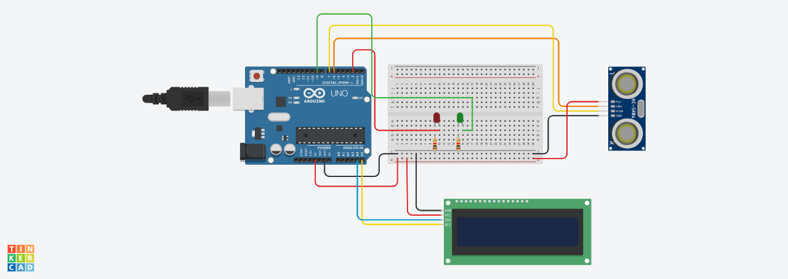

# Smart Water Tank Monitoring System

## Table of Contents
- [Introduction](#introduction)
- [Components](#components)
- [Basic Concepts](#basic-concepts)
- [Wiring](#wiring)
- [Basic Block Diagram and Flow Charts](#basic-block-diagram-and-flow-charts)
- [System Design and Implementation](#system-design-and-implementation)
  - [Hardware Implementation](#hardware-implementation)
  - [Software Architecture](#software-architecture)
  - [Dashboard](#dashboard)
  - [Testing and Optimization](#testing-and-optimization)
- [Future Scope](#future-scope)
- [Conclusion](#conclusion)

## Introduction
Water, the essence of life, stands at the forefront of global challenges as humanity grapples with environmental issues and the need for sustainable resource management. This report introduces a cutting-edge approach to water resource monitoring through an Internet of Things (IoT)-based system. With an acute awareness of the urgency surrounding water conservation, our proposed system utilizes IoT technology to offer real-time water level measurement. The user interface, featuring a dynamic dashboard, not only provides immediate insights but also empowers users to actively engage in the conservation effort by customizing minimum water level thresholds.

## Components
1. **Sensors:**
   - Ultrasonic Sensor: This critical component serves as the eyes of the system, employing ultrasonic waves to precisely measure the water level within the tank.

2. **Actuators:**
   - LEDs (Light Emitting Diodes): Functioning as visual indicators, LEDs play a pivotal role in communicating the water level status to users.
   - LCD (Liquid Crystal Display): This component further contributes to user interaction by displaying detailed information about the water level.

## Basic Concepts
1. **Arduino Uno:**
   - The Arduino Uno serves as the central microcontroller, orchestrating the communication between sensors, actuators, and the user interface.

2. **Node-RED:**
   - Node-RED, a flow-based development tool, facilitates the creation of a seamless connection between hardware devices, APIs, and online services.

3. **Raspberry Pi:**
   - The Raspberry Pi acts as a robust and compact computing unit, processing data received from the Arduino Uno, hosting the Node-RED server, and supporting the dynamic dashboard.

## Wiring
The system's hardware components are intricately connected to ensure seamless functionality. The ultrasonic sensor, responsible for measuring water levels, is connected to the Arduino Uno. This sensor utilizes ultrasonic waves to determine the distance to the water surface accurately. The Arduino Uno processes this data and, in conjunction with the Node-RED flow on the Raspberry Pi, facilitates the communication between components. Actuators, such as LEDs for visual indication and an LCD for additional feedback, are also connected to the Arduino Uno. This wiring configuration allows for efficient data flow and real-time monitoring of water levels.

## Basic Block Diagram and Flow Charts
1. **Block Diagram:**
   - The system's architecture can be represented through a comprehensive block diagram, illustrating the interconnections between key components.
     

2. **Flow Chart:**
   - The flow chart delineates the sequential steps and decision points within the system. It includes the following key processes: Data Acquisition, Actuation, Communication, Data Visualization, and User Interaction.
     

## System Design and Implementation
### Hardware Implementation
The physical realization of our system involves the meticulous connection and placement of components. The Ultrasonic Sensor, acting as the sensory input, is strategically positioned within the water tank to ensure accurate measurements. The Arduino Uno, serving as the central processing unit, orchestrates the entire operation. Its connections to the Ultrasonic Sensor, LEDs, and LCD form the backbone of the hardware implementation. Through careful wiring, the system ensures seamless communication, enabling real-time monitoring and actuation.

The LEDs serve as intuitive indicators of water level status, while the LCD provides detailed information for a comprehensive user experience.

### Software Architecture
The software architecture is a symphony of code and logic designed to ensure the seamless interaction of hardware components. The Arduino Uno, with its versatile programming capabilities, executes the code responsible for data processing, actuation, and communication. The Node-RED flow on the Raspberry Pi plays a pivotal role in managing the data flow between the Arduino Uno and the user interface.

Node-RED's acts as a bridge, facilitating communication between the local hardware setup and the cloud-based dashboard. This two-tiered communication ensures that data is not only processed in real-time but also made available for remote monitoring and analysis.

### Dashboard
The heart of user interaction lies in the design and functionality of the dashboard. Users can seamlessly interact with the system by customizing minimum water level thresholds. This customization not only enhances user engagement but also allows individuals to tailor the system to their specific water management needs.

### Testing and Optimization
A critical phase in the implementation involves rigorous testing to validate the system's accuracy, responsiveness, and reliability. Various scenarios, including fluctuating water levels and threshold modifications, are simulated to ensure the system performs as intended. Iterative optimization is carried out to address any discrepancies and enhance the overall efficiency of the system.

## Future Scope
The versatility of this project opens doors to a myriad of applications, extending its utility across diverse settings. The installation of this water monitoring system holds promise in the following areas:
1. **Private Residences and Bungalows:**
   - Providing homeowners with a comprehensive solution for effective water tank management.

2. **Housing Societies:**
   - Scaling up to cater to the water monitoring needs of entire residential communities.

3. **Apartments:**
   - Offering a practical and efficient solution for multi-unit dwellings to monitor and optimize water usage.

4. **Institutions (Schools, Colleges, Hostels):**
   - Enhancing water resource management in educational institutions and hostels, ensuring a sustainable approach.

5. **Hospitals:**
   - Addressing the critical need for precise water level monitoring in healthcare facilities for various applications.

## Conclusion
In conclusion, the Smart Water Tank Monitoring System seamlessly integrates Arduino Uno and Node-RED on Raspberry Pi, ensuring efficient data processing and responsive communication. Node-RED's visual programming enhances system efficiency, enabling real-time data processing and remote monitoring. The project's versatility extends its applications from private homes to municipal tanks, emphasizing its adaptability. This system represents a transformative approach to water management, offering sustainable solutions for diverse settings. In essence, it addresses immediate concerns and promotes conscientious water usage, showcasing the power of technology in enhancing efficiency and responsibility in resource management.
